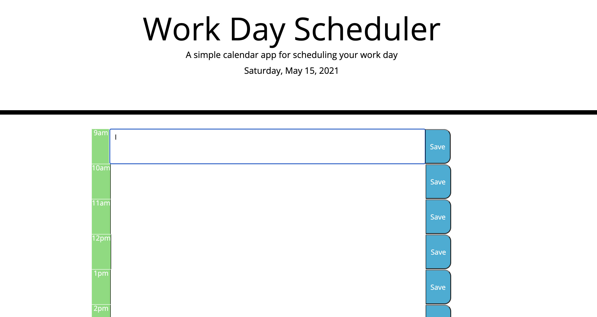

# homework-05-day-planner

Day Planner Web App

This project utilizes HTML, CSS, JavaScript, and Luxon. 

This app utilizes Luxon to determine date and time. It shows the past, present, and future tasks as well as uses local storage to show past entries. 

